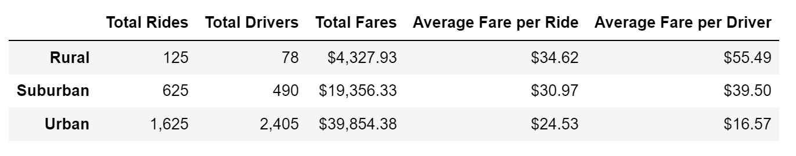
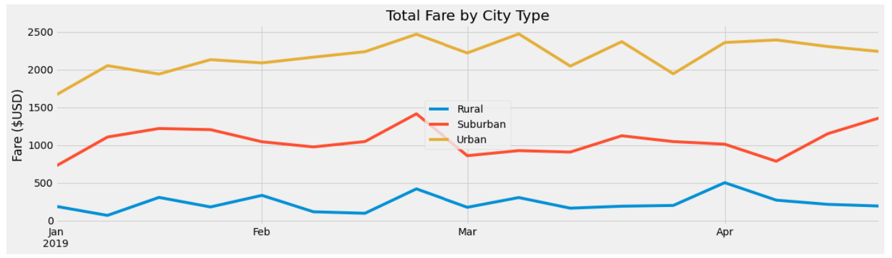
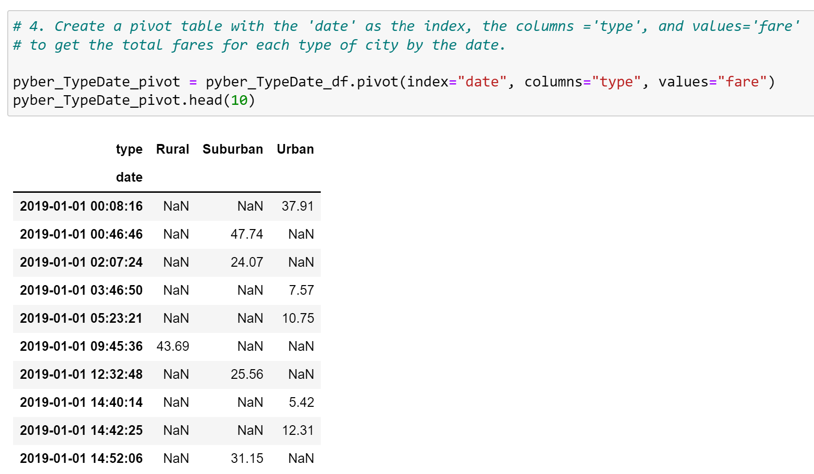
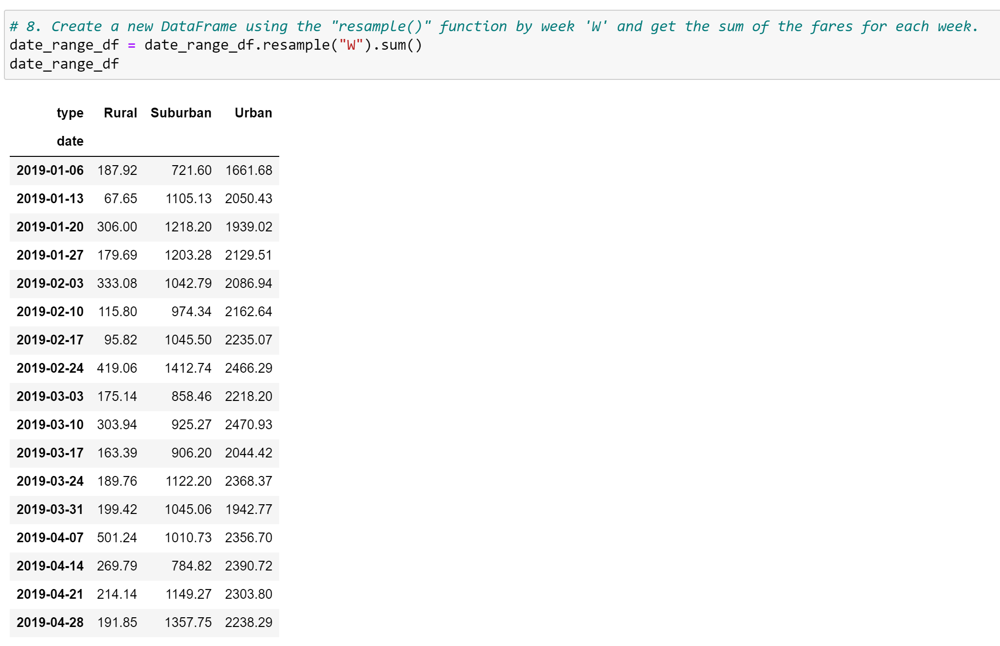
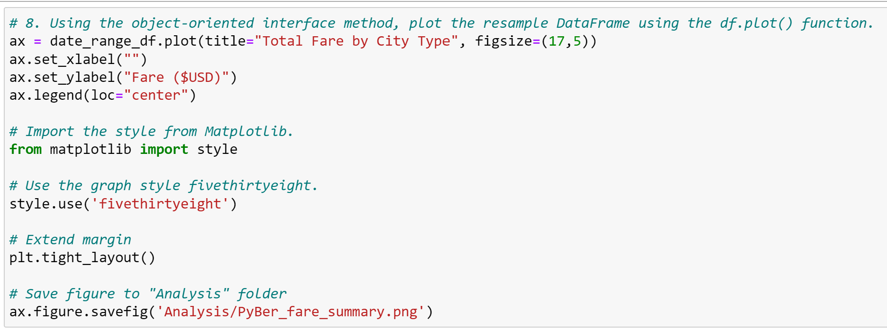

# PyBer_Analysis

## Overview of PyBer Analysis

After starting as a data analyst with PyBer, a python-based ride-sharing app company, I was tasked to perform an exploratory data analysis on rider and driver data across the nation. The data was to be read from csv files into panda data frames to create numermous visualizations depicting the relationship between the types of cities (e.g., Rural, Urban, and Suburban) and the number of riders and drivers.  The visualizations should also highlight the percentage of total fares by riders, drivers, and types of cities.  The analysis should help PyBer executives improve access and determine affordability in underserved cities.
 
### Resources

* Data Source:  city_data.csv, ride_data.csv
* Software:  Python 3.6.1, Jupyter Notebook (anaconda3), Visual Studio Code, 1.38.1
* Packages:  Pandas, NumPy, Matplotlib

## PyBer Analysis Results

### Summary of differences in ride-sharing data across cities

PyBer Summary Data Frame:

Across the three types of cities, urban cities make up the majority of the riders and drivers.  As you would expect, the number of riders and drivers decreases as the respective city populations decrease.  That being said, suburban had the second most riders and drivers, and rural areas had the lowest participation of riders and drivers.  Interestingly, the averages fares were inversely related to rider and driver participation.  Meaning that rural cities generated a higher average fare per rider and average fare per driver.

   * Differences in total rides
      
      Referencing the PyBer Summary Data Frame above, the number of rides provided in urban areas is almost two-thirds (or 1,625 rides) of the total rides provided by PyBer.  The largest presence of riders is in urban areas.  By contrast, rural areas represented only 125 rides and had the lowest ridership.

   * Differences in total drivers
      
      Similar to total rides, drivers were heavily concentrated in urban cities.  Roughly four out of five drivers were located in urban areas.  Suburban cities had the second largest concentration of drivers, where nearly 17 percent of the drivers are located in these cities.  Suprisingly, only 78 drivers were located in rural areas.  

   * Differences in total fares

      While reviewing the PyBer Summary Data Frame above, we quickly see that urban cities make up more than half (or 64 percent) of the total revenue generated.  Suburban cities make up nearly 30 percent of the total revenue, while rural cities make up the lowest portion of revenue generated (or 6 percent).       

   * Differences in average fares per ride

      The revenue relationship above is inversely related when we review the average fares per rider.  This means that urban cities have the lowest average fares per rider.  Suburban cities have the second highest average fares per rider, and rural cities have the highest average fares per rider.  This is largely due to the number of riders per city type.  Rural cities have by far the lowest number of riders, so the fares are spread across a smaller number of units.

   * Differences in average fares per driver

      When we review the average fares per driver, we see the same inverse relationship that we observed above in the average fares per rider.  Like above, the number of drivers (the denominator of the equation) will greatly impact the average fares per driver.  Because of this relationship, urban cities have the lowest average fares per driver.  On the other end of the spectrum, rural cities have the highest average fares per driver.

   * Differences in total fares by city type

      Total Fare by City Type:
      

      When viewing the line graph above, urban cities stand out as the largest revenue generator.  After reviewing the number of rides provided in the preceding section, we could have guessed that suburban cities have the second highest total fares, and rural cities have the lowest total fares.  This is confirmed by the Total Fares by City Type line chart above.
      
## Summary of Recommendations

To help the PyBer executives improve access and determine affordability in underserved cities, PyBer should:

   1. Market the average fare per ride in rural and suburban cities and/or create incentives to increase the number of suburban and rural drivers.  This will increase access in underserved areas.

   2. Focus expanding PyBer in urban cities to target riders most likely to use ride-sharing services.  This will greatly increase revenue through significantly larger user bases observed in urban areas.

   3. Capture new data points to understand the best target ratio of drivers to riders for each city type.  This will allow PyBer executives to create a targt level of drivers based on various rider levels (i.e., number of rides). 

## PyBer Analysis Code Snippets

Create Pivot Table:

Resample Code:

Create Line Graph:

